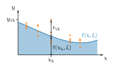
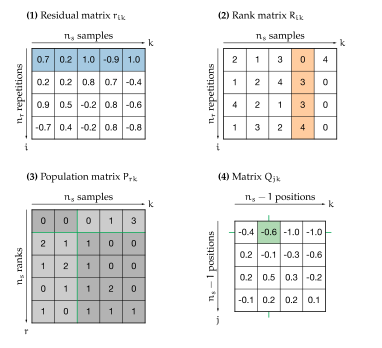

# Universal rank-order method

Highly vectorized python implementation of a universal rank-order method to analyze noisy data. The method is valuable for 

* nonlinear regression with heavy-tailed noise, and for 
* distinguishing between deterministic chaos and stochastic noise.


The method is briefly outlined in the section [nonlinear regression](#nonlinear-regression) and detailed in the publication 

> G. Ierley and A. Kostinski. *Universal rank-order transform to extract signals from noisy data*. [Phys Rev. X 9, 031039](http://dx.doi.org/10.1103/PhysRevX.9.031039) ([arXiv version](https://arxiv.org/abs/1906.08729))


## Nonlinear regression

The aim of nonlinear regression is to extract parameters from data through a mathematical model. Concretely, the regression using the rank-order method requires 

* data points (x<sub>k</sub>, y<sub>ik</sub>), with n<sub>s</sub> sampling locations x<sub>k</sub> and n<sub>r</sub> repeated observations y<sub>ik</sub> at each loaction, and 
* a model function f(x, &xi;) with adjustable parameters &xi; = (&xi;<sub>1</sub>, ..., &xi;<sub>n<sub>p</sub></sub>).


These ingredients are illustrated in <a href="#fig-regression">Fig. 1</a> for certain values of the parameters &xi;. From the residuals r<sub>ik</sub> = y<sub>ik</sub> - f(x<sub>k</sub>, &xi;) the method estimates the remaining signal content by a [universal transform](#universal-transform). The optimal parameters &xi;<sup>*</sup> are then found by numerically minimizing the signal content in the residuals. 


<figure class="figure">
	
	<figcaption><small>Figure 1: Ingredients for nonlinear regression</small></figcaption>
</figure>


### Universal transform

The universal transform consists of the following steps as exemplified in <a href="#fig-transform">Fig. 2</a>.


1. The transform starts with the residual matrix r<sub>ik</sub>. All residuals are ranked with increasing values for each row separately (blue shading) and build up the entries of the rank matrix R<sub>ik</sub>. In other words, the element r<sub>ik</sub> has rank R<sub>ik</sub> in the ith row of the residual matrix.

1. From the rank matrix R<sub>ik</sub> the occurances of each rank value are counted for each column separately (orange shading) and are summarized in the population matrix P<sub>rk</sub>. That is the rank r appears P<sub>rk</sub> times in the kth column of the rank matrix. 

1. The population matrix P<sub>rk</sub> is partitioned once in vertical and in horizontal direction between the jth and (j+1)th row and kth and (k+1)th column, respectively (green cross). From the partition the element  
<!---->

<!---->  
follows, where the angle brackets &#10216;&#183;&#10217; denote the mean over the highlighted matrix elements.

1. In the end we obtain the Q matrix. Finally, the signal content in the residuals is measured by the root mean square (rms) of the elements Q<sub>jk</sub>:  
<!---->


The ranking makes the method robust to outliers as ranks are ignorant to the precise residual values. Thus the universal regression method is valuable for data with heavy-tailed noise, where it outperforms the [least-squares method](https://en.wikipedia.org/wiki/Least_squares).


<figure class="figure">
	
	<figcaption><small>Figure 2: Steps of the universal transform</small></figcaption>
</figure>


### Implementation

As every regression analysis requires many universal transforms, the speed of the transform is crucial. It is improved by using vectorized functions from [numpy](https://numpy.org) and a method with better time complexity as presented in the publication

> D. Kestner, G. Ierley and A. Kostinski. *A fast algorithm for computing a matrix transform used to detect trends in noisy data*. [Comput. Phys. Commun. 254, 107382](http://dx.doi.org/10.1016/j.cpc.2020.107382) ([arXiv version](https://arxiv.org/abs/2001.09607))


## Installation

The package can be installed and updated via the package manager [pip](https://pip.pypa.io) with either of the following commands.

```shell
# install package
pip install git+https://github.com/samuehae/rankorder.git

# install package with additional dependencies for running examples
pip install git+https://github.com/samuehae/rankorder.git#egg=rankorder[examples]
```

The usage of the package is demonstrated with the Python scripts included in the folder `examples`.


The authors of the publication [Comput. Phys. Commun. 254, 107382](http://dx.doi.org/10.1016/j.cpc.2020.107382) provide [implementations](http://dx.doi.org/10.17632/mkcxrky9jc.1) for Julia and Matlab.


## Practical challenges and solutions

This section discusses practical challenges of the universal regression method and suggests potential solutions. Most of them are related to the discrete nature of method.


### Additive offsets

The universal method ignores additive offsets in the data, since the ranking step discards any information about values. As a consequence the model function can and should neglect additive offsets (see `examples/hyperbola_fit.py`).

If desired additive offsets can be retrieved from the residuals after fitting, for example as the mean &#10216;r<sub>ik</sub>&#10217;. This follows from the unweighted least-squares method with a constant model function f(x, &xi;) = &xi;.


### Missing data

In practice data sets might have missing data points, which should be excluded from the regression analysis. Such points (x<sub>k</sub>, y<sub>ik</sub>) can simply be masked by setting the variable y<sub>ik</sub> to [numpy.nan](https://numpy.org/doc/stable/reference/constants.html#numpy.nan) (see `examples/hyperbola_fit.py`).


### Numerical minimization

The rough structure of the cost function Q<sub>rms</sub> versus the parameters &xi; may trap the optimization routine in local minima (see `examples/biexponential_fit.py`). This challenge may be solved with the following suggestions.

* Try different minimization routines that are free of derivatives. For example the Nelder-Mead ([scipy.optimize.minimize](https://docs.scipy.org/doc/scipy/reference/generated/scipy.optimize.minimize.html)) or Basin-hopping ([scipy.optimize.basinhopping](https://docs.scipy.org/doc/scipy/reference/generated/scipy.optimize.basinhopping.html)) routines.

* Tune the arguments of the minimization routines, such as the initial guess and the tolerances.

* Plot the cost function Q<sub>rms</sub> versus the parameters &xi; or a subset thereof. This may help to shift the initial guess closer to the global minimum.

* Reduce the number of free parameters n<sub>p</sub> if possible. For example by fixing parameters with separate measurements or by using a simpler model function.

* To smoothen the cost function, increase the number of repetitions n<sub>r</sub> by collecting or simulating observations. For simulating observations, the measured observations are copied and weak normal noise is added. An appropriate choice for the standard deviation is a fraction of the uncertainty inherent to the data.


### Random noise

Data with less random noise exhibits a sharper minimum in the root mean square Q<sub>rms</sub> versus the fit parameters &xi; around their optimal values &xi;<sup>*</sup> (see `examples/hyperbola_fit.py`). 


Accordingly it is challenging to find the minimum for data with small noise level. Pre-whitening the data can thus help to find the global minimum. A suitable choice is to add normal noise with a standard deviation being a fraction of the uncertainty inherent to the data. The normal noise can be created with the function [numpy.random.normal](https://numpy.org/doc/stable/reference/random/generated/numpy.random.normal.html).


### Ties in ranking

During the ranking step it may happen that the same residual value appears several times. Especially for data with little noise, where the residuals can become close to zero. Such ties can be treated in different ways (see function `rankorder.fitting.q_rms_fit`):

* Ordinal ranking methods break ties according to the location of the elements in the residual matrix. The method might introduce biases, which can be mitigated as follows.

* Pre-whitening the data with random noise avoids ties in the first place and randomizes remaining ties during the ordinal ranking method. The pre-whitening is detailed in the section [random noise](#random-noise).

* Random ranking resolves ties by shuffling the order of ties randomly. A side effect is that the minimization needs to deal with a fluctuating cost function (root mean square Q<sub>rms</sub>). 

